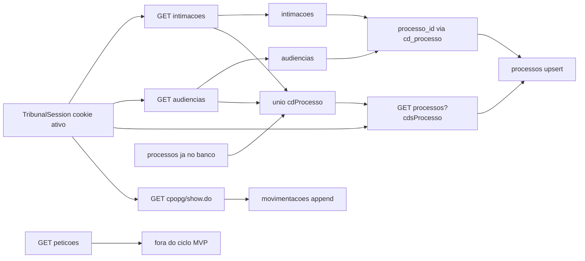
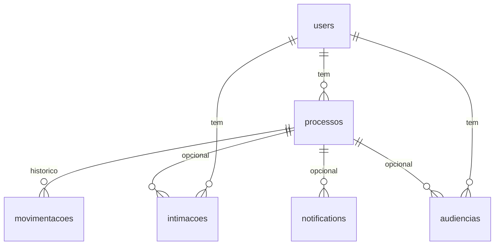

# Módulo: Contrato das APIs internas do e-SAJ (TJSP)

> Última atualização: 2026-08-25
> Camada: Backend / Scraping

---

## O que este módulo faz

Registra o **contrato observado** das APIs internas do e-SAJ (TJSP) e o mapeamento campo → coluna dos pipes. Fonte original: capturas do lab em `scripts/esaj/results/` (gitignorado). Em 2026-08-20 o ciclo real (`coleta_esaj.executar_ciclo_usuario`) foi rodado contra uma sessão `ativo` e cruzado com o painel do advogado — os achados dessa validação estão na seção correspondente, sem payload cru no Git.

Fonte das capturas de lab: 2026-07-02 (detalhe CPO) e 2026-07-03 (JSON `tarefas-adv/api`). Os JSON crus **não** entram no Git: têm nome de parte, OAB e número de processo.

---

## Arquivos principais

| Arquivo | Responsabilidade |
|---|---|
| `scripts/esaj/results/*.json` | Capturas locais (gitignoradas) — fonte deste contrato |
| `backend/app/models/processo.py` | Destino do GET `/api/processos` (upsert) |
| `backend/app/models/intimacao.py` | Destino do GET `/api/intimacoes` |
| `backend/app/models/audiencia.py` | Destino do GET `/api/audiencias` — `id_esaj` **composto no ETL** (a API não manda `id`) |
| `backend/app/models/movimentacao.py` | Destino do HTML CPO — **não vem do JSON de processos** |
| `backend/app/models/peticao_diversa.py` | Destino do bloco “Petições diversas” do CPO (não é `GET /api/peticoes`) |
| `backend/app/models/audiencia_cpo.py` | Destino da tabela de audiências da capa CPO — **não misturar** com `audiencias` JSON |
| `backend/app/services/auth_esaj.py` | Warm-up das 4 telas `tarefas-adv` que habilitam essas APIs |
| `backend/app/services/esaj_http.py` | Client httpx autenticado + `buscar_json` + `buscar_html` (CPO) + detecção de sessão inválida + `validar_itens` (item a item, sem logar payload) |
| `backend/app/schemas/esaj_raw.py` | Schemas Pydantic do payload bruto JSON (`IntimacaoRaw`, `AudienciaRaw`, `ProcessoRaw`, `ParteRaw`) |
| `backend/app/schemas/esaj_cpo_raw.py` | Schema do payload extraído do HTML do CPO (`CpoDetalheRaw`, capa/partes/petições/audiências CPO) |
| `backend/app/services/esaj_cpo_parser.py` | Parser do HTML do CPO — movimentações + capa + partes + petições + audiências da página (ADR-012, ADR-013) |
| `backend/app/etl/etl.py` | Normalização (timezone, id composto de audiência, parse de data `dd/mm/aaaa` do CPO, truncate de `titulo`/`local`/`id_esaj` em 255, bruto → campos do model) |
| `backend/app/etl/diff.py` | Diff contra o banco, upsert de `Processo`, geração de `Notification` e `is_new=False` após notificar |
| `backend/app/services/pipes/pipe_intimacoes.py`, `pipe_audiencias.py`, `pipe_processos.py`, `pipe_movimentacoes.py` | Coleta (fetch) de cada API/HTML |
| `backend/app/services/coleta_esaj.py` | Orquestrador do ciclo por advogado (`executar_ciclo_usuario`) e de todos (`executar_ciclo_todos_usuarios`); seleciona o lote de movimentações via `_selecionar_lote_movimentacoes` |
| `backend/scripts/capturar_cpo.py` | Script local (gitignorado o resultado) para capturar HTML real do CPO e gerar fixture de parser |
| `backend/scripts/disparar_coleta.py` / `verificar_coleta.py` | Smoke manual (não é pytest): dispara o ciclo e imprime relatório sanitizado |
| `backend/tests/fixtures/cpo_sample*.html` | Fixtures sintéticas (dados fake, estrutura real) para os testes do parser |

Pipes, schemas do bruto e orquestrador implementados na Etapa 7 — intimações, audiências e upsert de ficha de processos. Validado ao vivo em 2026-08-20 (primeiro ciclo persiste; segundo ciclo diff = 0). `pipe_peticoes.py` continua stub (fora do ciclo, ADR-010 — rascunhos “Assinar e enviar”). Na Etapa 8 o APScheduler passou a chamar `executar_ciclo_usuario` a cada 10 minutos. Em 2026-08-22 o pipe de movimentações via HTML do CPO entrou no ciclo (ADR-012). Em 2026-08-25 o **mesmo fetch** passou a persistir capa complementar, partes, petições diversas e audiências da página (ADR-013) — sem pipe HTTP nova.

---

## Endpoints (e-SAJ, não a nossa API)

Auth: cookie de sessão do advogado (`JSESSIONID` de `/tarefas-adv` + `CASTGC`), já persistido criptografado em `TribunalSession`. Base: `https://esaj.tjsp.jus.br`.

| Método | Rota observada | O que devolve | No ciclo de 10 min? |
|---|---|---|---|
| GET | `/tarefas-adv/api/intimacoes` | Array de intimações da carteira | Sim → `intimacoes` |
| GET | `/tarefas-adv/api/audiencias` | Array de audiências da carteira | Sim → `audiencias` |
| GET | `/tarefas-adv/api/processos?cdsProcesso=` | Array de fichas; **exige** um ou mais `cdsProcesso` | Sim → `processos` upsert |
| GET | `/tarefas-adv/api/peticoes?situacao=AGUARDANDO_ASSINATURA` | Rascunhos pendentes de assinatura | **Não** (ver petições) |
| GET | `/cpopg/show.do?processo.codigo=` | HTML da capa + movimentações | Sim, lote pequeno por ciclo com throttle por processo (ADR-012) |
| GET | `/cpopg/abrirPastaDigitalIntegracao.do?cdProcesso=` | Pasta digital (URL já vem no JSON de processos) | Fora do MVP (PDF) |

Envelope das capturas JSON do lab (wrapper nosso, não do e-SAJ): `endpoint`, `status_code`, `fetched_at`, `final_url`, `ok`, `data`, `error`, `auth_redirect`. O contrato abaixo descreve só `data`.

Resposta `data`: **array na raiz** (não `{ items: [] }`). Sem paginação observada nessas capturas.

---

## Fluxo: de onde sai, onde cai



**Versionamento do MVP** (já no schema — não é tabela de versões):

- `processos`: 1 linha atual por `(user_id, cd_processo)` — upsert da ficha.
- `intimacoes` / `audiencias` / `movimentacoes`: evento append-only com unique; o diff notifica só o que é **novo**.

**Auto-relação processo → processo** (apenso, recurso): **não aparece** nesses JSON. Não modelar até o payload exigir e o painel pedir.

---

## 1. Intimações — `GET /tarefas-adv/api/intimacoes`

Tela no lab: `/tarefas-adv/intimacoes` (warm-up). **No painel do advogado (validação 2026-08-20)** a lista equivalente é o menu **Manifestações / ciência** — a rota HTML `/tarefas-adv/intimacoes` pode vir vazia e mesmo assim a API JSON devolve os itens. O rótulo de produto no nosso painel deve seguir “Manifestações / ciência”, não “Intimações” isolado. Sem query na captura.

Exemplo sanitizado de um item de `data`:

```json
{
  "id": "cdProcesso=1A0000XXXX0000,nuSeqIntimacao=10,nuSeqProcessoMv=19,oab=XXXXXXUF",
  "titulo": "Mero expediente",
  "descricao": "Texto da intimação...",
  "cdProcesso": "1A0000XXXX0000",
  "instancia": "PG",
  "dataMovimentacao": "2026-06-30T11:14:06",
  "ciencia": false
}
```

| Campo API | Destino | Notas |
|---|---|---|
| `id` | `intimacoes.id_esaj` | Composto estável na captura. **Contém OAB** — persiste como chave, **nunca logar**. Cortado em 255 no ETL (`ID_ESAJ_MAX`) |
| `titulo` | `intimacoes.titulo` | Cortado em 255 no ETL (`TITULO_MAX`) |
| `descricao` | `intimacoes.descricao` | Texto longo; sanitizar no front (XSS) |
| `cdProcesso` | join → `processos.cd_processo` | `processo_id` nullable até a ficha existir |
| `instancia` | `intimacoes.instancia` | Ex.: `PG` |
| `dataMovimentacao` | `intimacoes.data_movimentacao` | Sem timezone — ver padrão abaixo |
| `ciencia` | `intimacoes.ciencia` | `false` = ainda sem ciência no e-SAJ |

Unique já no banco: `(user_id, id_esaj)`.

---

## 2. Audiências — `GET /tarefas-adv/api/audiencias`

Tela: `/tarefas-adv/audiencias`. Sem query na captura. **Não há campo `id`.**

Exemplo sanitizado:

```json
{
  "dataMovimentacao": "2026-05-25T17:30:29",
  "dataAudiencia": "2026-07-21T16:00:00",
  "situacao": "Pendente",
  "titulo": "Instrução, Debates e Julgamento",
  "local": "Sala de Audiências",
  "cdProcesso": "1A0000XXXX0000"
}
```

| Campo API | Destino | Notas |
|---|---|---|
| `titulo` | `audiencias.titulo` | Entra no `id_esaj` composto; cortado em 255 no ETL (`TITULO_MAX`) |
| `local` | `audiencias.local` | Fora da chave (mudança de sala não cria evento novo); cortado em 255 (`LOCAL_MAX`) |
| `dataAudiencia` | `audiencias.data_audiencia` | Entra no `id_esaj` composto |
| `cdProcesso` | join → `processos` | Entra no `id_esaj` composto |
| `situacao` | **não persiste** | MVP: “Pendente” = `data_audiencia >= agora` |
| `dataMovimentacao` | **não persiste** | Data do andamento que gerou a audiência, não a sessão |

**`id_esaj` (ADR-010):** o ETL monta um id canônico estável e grava em `audiencias.id_esaj`:

```text
cdProcesso={cd}|dataAudiencia={iso}|titulo={titulo}
```

Unique continua `(user_id, id_esaj)`. Não usar UUID por captura (o diff duplicaria a cada ciclo). Se o composto passar de 255, o ETL trunca **só o título** na chave (prefixo `cdProcesso|dataAudiencia` permanece). Se o e-SAJ mudar só o título da mesma sessão, pode nascer um evento “novo” e um órfão — aceitável no MVP.

---

## 3. Processos (ficha) — `GET /tarefas-adv/api/processos`

Tela: home `tarefas-adv`. Query **obrigatória**: um ou mais `cdsProcesso` repetidos.

```
GET /tarefas-adv/api/processos?cdsProcesso=AAA&cdsProcesso=BBB
```

Não é “lista da carteira”. A captura pediu 4 códigos e **devolveu 3** (HTTP 200, item omitido). O pipe deve tratar código ausente sem falhar o lote.

Exemplo sanitizado de um item:

```json
{
  "cdProcesso": "1A0000XXXX0000",
  "nuProcesso": "00000000000000000000",
  "deClasse": "Procedimento Comum Cível",
  "deAssunto": "Assunto do processo",
  "instancia": "PG",
  "parteAtiva": { "nome": "Parte Ativa", "representada": true },
  "partePassiva": { "nome": "Parte Passiva", "representada": false },
  "urlCpo": "https://esaj.tjsp.jus.br/cpopg/show.do?processo.codigo=1A0000XXXX0000",
  "urlPasta": "https://esaj.tjsp.jus.br/cpopg/abrirPastaDigitalIntegracao.do?cdProcesso=1A0000XXXX0000&modoServico=false"
}
```

| Campo API | Destino | Notas |
|---|---|---|
| `cdProcesso` | `processos.cd_processo` | Unique com `user_id` |
| `nuProcesso` | `processos.nu_processo` | Dígitos sem máscara na API |
| `deClasse` | `processos.de_classe` | |
| `deAssunto` | `processos.de_assunto` | |
| `instancia` | `processos.instancia` | |
| `parteAtiva` | `processos.parte_ativa` JSONB | Só `nome` + `representada` na captura; PRD cita `nomeSocial` — ausente |
| `partePassiva` | `processos.parte_passiva` JSONB | `nome` pode faltar (petição aninhada veio só `representada`) |
| `urlCpo` | `processos.url_cpo` | Só `https://esaj.tjsp.jus.br/cpopg/...` (`url_cpo_publica`); URL de outro host vira `None` |
| `urlPasta` | `processos.url_pasta` | |
| — | `processos.status` | **Não veio** nesta API |

**Não traz movimentações.** Histórico = HTML do CPO (`tbody#tabelaTodasMovimentacoes`, ver seção 5 e ADR-012).

**De onde saem os `cdsProcesso` (ADR-010):**

- **Ciclo de 10 min:** união de `cdProcesso` de intimações + audiências + linhas **já** em `processos` daquele advogado. Código pedido que não voltar no 200: `job_log` skip, não derruba o lote.
- **Carteira completa** (“todos os processos” do PRD): importação à parte, quando o Network da home `tarefas-adv` revelar outra lista. Não bloqueia intimação/audiência/ficha. Processo quieto ainda não persistido fica de fora até essa importação.

---

## 4. Petições — `GET /tarefas-adv/api/peticoes`

Captura com `?situacao=AGUARDANDO_ASSINATURA`. **Não é** andamento do processo: é rascunho no peticionamento, com `cdProtocolo` UUID e `urlPeticionamento`. O objeto `processo` aninhado tem `nuProcesso` e partes — **sem** `cdProcesso`.

No painel do advogado isso é o menu **Assinar e enviar** / cards **Assinatura pendente** (ex.: “Petição Intermediária - Digitalização”). Confirmado na validação 2026-08-20 — não entra no ciclo de monitoramento.

Não há tabela `peticoes` para o JSON de `tarefas-adv`. **Fora do ciclo de 10 minutos** (ADR-010). O PRD citava `pipe_peticoes.py`; o JSON real não é andamento nos autos. Petição que aparece no bloco “Petições diversas” do CPO vai para `peticoes_diversas` (ADR-013) — **não** para `movimentacoes` e **não** para o JSON de rascunhos.

Se o produto pedir um card “aguardando assinatura” depois: unique `cdProtocolo` por advogado, tabela própria — não misturar com `movimentacoes`. Outros valores de `situacao` não foram capturados.

---

## 5. Detalhe CPO — `GET /cpopg/show.do?processo.codigo=`

HTML da página inteira, não JSON. Fetch via `esaj_http.buscar_html` (headers de navegação de página, sem `X-Requested-With`). Parseado com BeautifulSoup/lxml em `esaj_cpo_parser.parsear_cpo_html` — ver ADR-012 (movimentações) e ADR-013 (capa e demais blocos). Achados de capturas reais (`backend/scripts/capturar_cpo.py`, HTML gitignorado):

- Existem **dois** `<tbody>` com as movimentações: `tabelaUltimasMovimentacoes` (só as últimas N, visível por padrão no portal) e `tabelaTodasMovimentacoes` (**todas**, com `style="display: none"` — só oculto por CSS, o HTML já vem completo, sem paginação AJAX). **O parser usa sempre o segundo.**
- Cada linha é um `tr.containerMovimentacao` dentro do `tbody`, com `td.dataMovimentacao` (`dd/mm/aaaa`, sem hora) e `td.descricaoMovimentacao` (texto livre: 1ª linha = título curto; linhas seguintes, quando existem, vêm de um `<span style="font-style: italic;">` com detalhe — "Relação: X", "Teor do ato: ...", "Advogados(s): ...").
- **Documento vinculado:** `a.linkMovVincProc` (“Visualizar documento em inteiro teor”). Href real `/cpopg/abrirDocumentoVinculadoMovimentacao.do?...` vira URL `https://esaj.tjsp.jus.br/...` (`tem_documento=true`, `url_documento` preenchida). `#liberarAutoPorSenha` (pede senha dos autos / ciência) só marca `tem_documento=true` — **nunca** vira `url_documento`. `javascript:` e outros hosts são descartados.
- **Sem problema de cabeçalho-como-linha** nas movimentações. Nas 4 capturas acessíveis da rodada inicial, todas as 662 linhas somadas tinham `data` e `descricao` preenchidos. Petições diversas e audiências CPO **têm** cabeçalho `tr.label` (1ª linha `Data` / `Tipo` etc.) — o parser descarta essa linha.
- **O popup `#popupSenha`** ("Se for uma parte ou interessado, digite a senha do processo") está presente em **toda** página, inclusive nas acessíveis — não é sinal de bloqueio. O sinal real é a **ausência** do `tbody#tabelaTodasMovimentacoes` no HTML. Com `requer_senha_processo=True` **não** se grava capa/partes/petições/audiências CPO (ADR-013).
- Blocos localizados pelo `h2.tituloDoBloco` (texto normalizado, sem acento) — a tabela de petições **não** tem `id` estável.
- Campos JSON (`de_classe`, `de_assunto`, polos) **não** são sobrescritos pelo CPO.

| Campo parseado | Destino | Notas |
|---|---|---|
| `td.dataMovimentacao` | `movimentacoes.data_movimentacao` | `dd/mm/aaaa` → meia-noite `America/Sao_Paulo` (`parse_data_movimentacao_cpo`); formato diferente do ISO das APIs JSON |
| 1ª linha de `td.descricaoMovimentacao` | `movimentacoes.titulo` | Cortado em 255 (`TITULO_MAX`) |
| `td.descricaoMovimentacao` (texto completo) | `movimentacoes.descricao` | Título + detalhe, igual ao que o portal mostra |
| `a.linkMovVincProc` com path `abrirDocumentoVinculadoMovimentacao.do` | `movimentacoes.tem_documento` + `url_documento` | Só https no host `esaj.tjsp.jus.br`; URL longa demais vira `None` (não trunca) |
| `a.linkMovVincProc` com `#liberarAutoPorSenha` | `movimentacoes.tem_documento=true`, `url_documento=None` | Pede senha dos autos — a SPA abre a ficha CPO (`url_cpo`), nunca o hash |
| Ausência de `tabelaTodasMovimentacoes` | `requer_senha_processo=True` | Pula o processo neste ciclo; **não** pede/guarda senha de autos |
| `#foroProcesso`, `#varaProcesso`, `#juizProcesso`, `#dataHoraDistribuicaoProcesso`, `#numeroControleProcesso`, `#areaProcesso`, `#valorAcaoProcesso` | `processos.foro` / `vara` / `juiz` / `distribuicao` / `controle` / `area` / `valor_acao` | Texto do portal; **não** parsear moeda. Label do valor tem typo `lavelValorAcaoProcesso` — usar o **id do valor**. Classe/assunto JSON não entram aqui |
| `#tableTodasPartes` (`td.label` + `td.nomeParteEAdvogado`) | `processos.partes_cpo` JSONB `[{papel, nome, advogados}]` | Quando essa tabela **não vem** no HTML, usa `tablePartesPrincipais` (lista visível). Polo JSON do card não muda |
| Tabela após `h2` “Petições diversas” | `peticoes_diversas` | Descarta `tr.label`. Unique: protocolo na linha se existir; senão hash `data\|tipo\|texto_extra` |
| Tabela após `h2` “Audiências” / `td#processoSemAudiencias` | `audiencias_cpo` | Colunas Data / Audiência / Situação / Qt. Pessoas. **Não** misturar com `audiencias` JSON |
| `td#processoSemIncidentes` / `tbody#dadosApensosNaoDisponiveis` | `processos.sem_incidentes` / `sem_apensos` | Flags booleanas; `None` no banco = CPO ainda não passou. Sem vínculo processo→processo |
| Histórico de classes, CDA, PDF, linhas preenchidas de incidentes/apensos | — | Fora de escopo (ADR-013) |

`urlCpo` / `urlPasta` já vêm no GET de processos — não precisa redescobrir.

### 5.1 Pipe de movimentações — throttle e dedupe (ADR-012 / ADR-013)

Fetch de HTML inteiro é bem mais caro que os GETs JSON dos outros pipes, então `pipe_movimentacoes` **não** busca todos os processos do advogado a cada ciclo. O throttle vale para **todo** o CPO (capa, partes, petições, audiências da página e movimentações):

- Coluna `Processo.movimentacoes_synced_at` (nullable, `DateTime(timezone=True)`). `coleta_esaj._selecionar_lote_movimentacoes` pega só `pipe_movimentacoes.MOVIMENTACOES_LOTE` (5) processos por ciclo. Ordem: nunca buscado → `partes_cpo = []` (precisa do fallback de `tablePartesPrincipais`) → `movimentacoes_synced_at` mais antigo. Round-robin: quem nunca foi buscado tem prioridade, depois complemento incompleto, depois quem está mais atrasado.
- `movimentacoes_synced_at` só avança após fetch **e** persistência ok (ou bloqueio por senha dos autos). `EsajPortalIndisponivelError` e `IntegrityError` no savepoint **não** atualizam o timestamp — o processo volta à fila no próximo ciclo.
- `EsajSessaoInvalidaError` / `EsajRateLimitError` sobem para o orquestrador (mesmo tratamento dos outros pipes) — afetam a sessão inteira, não um processo isolado.
- Diff de movimentação por `(processo_id, data_movimentacao, descricao_hash)`. Petição diversa por `(processo_id, identidade_hash)`. Audiência CPO por `(processo_id, identidade_hash)`. Capa/partes/flags = upsert no `Processo`.
- Linhas **já persistidas** de movimentação recebem backfill de `tem_documento` / `url_documento` no mesmo ciclo.
- Notificação só `tipo="movimentacao"` para andamento novo. Petição diversa e audiência CPO **não** geram `Notification` (backfill geraria ruído, ADR-013).

---

## Validação ao vivo (2026-08-20)

Ciclo real com cookie de `TribunalSession` (`status=ativo`, dentro das 22h), via `backend/scripts/disparar_coleta.py`. Sem payload no Git.

| Checagem | Resultado |
|---|---|
| Cookie autenticou `GET /api/intimacoes`, `/api/audiencias`, `/api/processos?cdsProcesso=` | HTTP 200 nos três; sessão continuou `ativo` |
| Primeiro ciclo | 4 intimações + 1 audiência + 5 fichas (união dos `cdProcesso`) + 5 notificações; todos com `processo_id` preenchido |
| Segundo ciclo (diff) | 3 pipes `sucesso` de novo; delta 0 em intimações, audiências, processos e notificações |
| Cruzamento no painel do advogado | Quantidade, títulos e sala da audiência bateram |
| Tela HTML `/tarefas-adv/intimacoes` | Vazia. As 4 intimações estão em **Manifestações / ciência** |
| Tela `/tarefas-adv/audiencias` | 1 item. Home `tarefas-adv` também mostra o card da audiência |
| Assinar e enviar | Rascunhos de peticionamento — **não** coletados (ADR-010, correto) |

**Timezone da audiência:** o portal mostrou 25/08 às **14:00** (Brasília). O valor persistido foi `…T17:00:00+00:00`. 17:00 UTC = 14:00 BRT — o instante está certo **se** o painel converter para `America/Sao_Paulo`. O padrão antigo deste doc (“naive = já é Brasília”) teria virado 17:00 BRT e **não** batería com o portal. Pendência: no painel sempre formatar em `America/Sao_Paulo`; só revisitar `parse_datetime_esaj` se a UI mostrar 17h.

Smoke (a partir de `backend/`):

```bash
python -m uv run python scripts/verificar_coleta.py --email <email-da-plataforma>
python -m uv run python scripts/disparar_coleta.py --email <email-da-plataforma>
```

Os scripts não imprimem cookie, CPF nem `id_esaj` de intimação. A saída ainda pode ter número CNJ e título — não colar em issue/commit. O logger padrão do `httpx` (que logava a URL completa, com `cdsProcesso` na query, em INFO) foi rebaixado para `WARNING` em `app/services/esaj_http.py` na Etapa 8 — vale para scheduler, scripts e testes.

---

## Validação ao vivo — CPO / movimentações (2026-08-22)

`backend/scripts/capturar_cpo.py` baixou o HTML de 5 processos de uma sessão `ativo`. HTML gitignorado; só os agregados abaixo (sem número de processo, nome ou OAB):

| Captura | `tabelaTodasMovimentacoes` | Movimentações extraídas |
|---|---|---|
| 1 | presente | 72 |
| 2 | presente | 15 |
| 3 | presente | 467 |
| 4 | **ausente** (sem acesso pleno) | 0 — `requer_senha_processo=True` |
| 5 | presente | 108 |

O parser (`esaj_cpo_parser.parsear_cpo_html`) foi rodado contra as 5 capturas reais como smoke local (não faz parte da suíte, HTML não é fixture) e os números bateram com a inspeção manual. A suíte usa fixtures sintéticas (`backend/tests/fixtures/cpo_sample*.html`) com dados fake, mas estrutura de tags/classes idêntica à real.

---

## Padrões seguidos neste contrato

- **Bruto → Pydantic item a item → banco:** `validar_itens` em cada pipe; item malformado é omitido. Um registro ruim não derruba a carteira
- **VARCHAR(255):** `titulo` / `local` / `id_esaj` (e o título dentro da chave composta de audiência) são cortados no ETL (`TITULO_MAX` / `ID_ESAJ_MAX`) — sem migration agora
- **`is_new`:** depois de `gerar_notificacoes`, as linhas recém-persistidas ficam `is_new=False` — a notificação já foi emitida; a flag não mente para o painel
- **Cookie só em memória no job:** decriptar `cookie_encrypted` na hora do GET, nunca logar, nunca devolver na nossa API. `executar_ciclo_usuario` recusa sessão `ativo` com `cookie_expirado()`
- **Diff por unique:** intimação = `id` da API em `id_esaj`; audiência = id composto `cdProcesso|dataAudiencia|titulo` (ADR-010); movimentação = `(processo_id, data_movimentacao, descricao_hash)` (ADR-012); processo = upsert
- **Throttle por processo, não por advogado:** `pipe_movimentacoes` busca só um lote pequeno (`MOVIMENTACOES_LOTE`) por ciclo, round-robin via `Processo.movimentacoes_synced_at` — nunca todos os processos de uma vez (ADR-012)
- **Bloqueio de CPO é ausência de dado, não texto de popup:** `tabelaTodasMovimentacoes` ausente no HTML ⇒ `requer_senha_processo=True`; nunca inferir isso do popup `#popupSenha` (presente em toda página, inclusive acessível)
- **Timezone:** timestamps da API vêm **sem offset**. Validação 2026-08-20: o instante gravado como UTC bateu com a hora de Brasília do portal (17:00 UTC = 14:00 BRT). O painel deve **exibir** em `America/Sao_Paulo`. Não assumir mais, sem conferir, que o naive da API já é horário de Brasília (isso deslocaria +3h na UI).
- **Exemplos neste doc:** sempre sanitizados. `scripts/esaj/results/` permanece gitignorado
- **Escopo:** só XHR das telas do MVP + CPO da capa. Outras rotas (prazos, mensagens, PDF) = backlog quando o UI pedir o campo

---

## Modelo de dados relacionado

Schema atual (sem nova auto-relação):



Trecho que o GET de processos alimenta:

```python
class Processo(UUIDPrimaryKeyMixin, TimestampMixin, Base):
    __tablename__ = "processos"
    __table_args__ = (UniqueConstraint("user_id", "cd_processo"),)

    user_id: Mapped[uuid.UUID]
    tribunal: Mapped[str]          # "esaj_tjsp" — nosso, não vem da API
    cd_processo: Mapped[str]       # cdProcesso
    nu_processo: Mapped[str | None]
    de_classe: Mapped[str | None]
    de_assunto: Mapped[str | None]
    instancia: Mapped[str | None]
    parte_ativa: Mapped[dict | None]   # JSONB {nome, representada}
    parte_passiva: Mapped[dict | None]
    url_cpo: Mapped[str | None]
    url_pasta: Mapped[str | None]
    status: Mapped[str | None]         # não vem do GET /api/processos
    movimentacoes_synced_at: Mapped[datetime | None]  # throttle de todo o HTML do CPO (ADR-012 / ADR-013)
    foro / vara / juiz / distribuicao / controle / area / valor_acao  # capa CPO; texto
    partes_cpo: Mapped[list[dict] | None]  # JSONB [{papel, nome, advogados}]
    sem_incidentes / sem_apensos: Mapped[bool | None]  # None = CPO ainda não passou
```

Tabelas irmãs (mesmo fetch, ADR-013): `peticoes_diversas` (unique `processo_id` + `identidade_hash`) e `audiencias_cpo` (idem). Não misturar `audiencias_cpo` com `audiencias`.

---

## Dependências de outros módulos

| Módulo | Por quê depende |
|---|---|
| Login e-SAJ | Cookie válido e warm-up `tarefas-adv` senão as APIs redirecionam para login |
| Credenciais / sessão | `TribunalSession.status == ativo`, cookie presente e **não** expirado (`cookie_expirado()`) |
| Migrations | Tabelas destino já existem |

Módulos que já dependem deste:

| Módulo | Uso |
|---|---|
| Painel de processos | Home consome `GET /processos` e `GET /notifications` — ver `/docs/modulos/processos.md` |
| Scheduler | Chama `coleta_esaj.executar_ciclo_usuario` por advogado a cada 10 min — ver `/docs/modulos/scheduler.md` |

---

## O que NÃO fazer aqui

- ❌ Não tratar a rota HTML `/tarefas-adv/intimacoes` como a lista que o advogado vê — a API JSON alimenta **Manifestações / ciência**
- ❌ Não commitar `scripts/esaj/results/` nem fixtures com nome, OAB, CPF ou número real
- ❌ Não logar `intimacoes.id` (leva OAB), cookie, nem a URL completa do GET de processos (`cdsProcesso` na query)
- ❌ Não logar o input de `ValidationError` — `validar_itens` só loga tipo do erro e nome do campo
- ❌ Não alargar `id_esaj`/`titulo`/`local` via migration só porque um título longo apareceu — truncar no ETL; migration só se o composto de audiência começar a colidir (backlog)
- ❌ Não deixar `is_new=True` depois de `gerar_notificacoes` — a notificação já foi emitida; a flag mentiria para o painel
- ❌ Não tratar GET `/api/processos` sem `cdsProcesso` como lista da carteira
- ❌ Não assumir que 200 devolveu todos os códigos pedidos
- ❌ Não inventar `id_esaj` de audiência por UUID aleatório a cada ciclo — usar o composto `cdProcesso|dataAudiencia|titulo` (se passar de 255, trunca só o título na chave)
- ❌ Não esperar a carteira completa para começar intimação/audiência/ficha
- ❌ Não gravar petição `AGUARDANDO_ASSINATURA` em `movimentacoes` nem no ciclo de 10 min
- ❌ Não inventar movimentação a partir de `peticoes_diversas` do CPO — bloco próprio, tabela `peticoes_diversas`
- ❌ Não misturar audiência da capa CPO com a tabela `audiencias` (agenda JSON da carteira)
- ❌ Não sobrescrever `de_classe` / `de_assunto` / polos JSON com o CPO
- ❌ Não modelar apenso/recurso (auto-relação) — só flags de empty state
- ❌ Não persistir histórico de classes, CDA ou PDF nesta etapa
- ❌ Não gerar `Notification` para petição diversa ou audiência CPO (backfill)
- ❌ Não guardar senha de autos / segredo de justiça
- ❌ Não parsear `tabelaUltimasMovimentacoes` como se fosse o histórico completo — só tem as últimas N; usar `tabelaTodasMovimentacoes` (ADR-012)
- ❌ Não usar o texto do popup `#popupSenha` para decidir se o processo está bloqueado — ele existe em toda página, inclusive acessível; o sinal é a ausência da tabela de movimentações
- ❌ Não buscar o HTML do CPO de todos os processos do advogado no mesmo ciclo — respeitar o lote/throttle de `Processo.movimentacoes_synced_at` (ADR-012)
- ❌ Não transformar `#liberarAutoPorSenha` nem `javascript:` em `url_documento`
- ❌ Não baixar, guardar ou fazer proxy do PDF vinculado — o advogado abre o e-SAJ no próprio browser
- ❌ Não varrer o e-SAJ atrás de "todas as APIs" — só XHR das telas que o produto mostra

---

## Decisões aceitas (ADR-010 / ADR-012 / ADR-013)

| Tema | Escolha |
|---|---|
| Unique de audiência JSON | `id_esaj` composto `cdProcesso={cd}\|dataAudiencia={iso}\|titulo={titulo}`; unique `(user_id, id_esaj)` intacto |
| `situacao` / `dataMovimentacao` da audiência JSON | Não persistem no MVP |
| `cdProcesso` no ciclo | União intimação + audiência + `processos` já salvos; omitido no 200 = skip |
| Carteira completa | Importação à parte; não bloqueia os pipes de monitoramento |
| Movimentações — fonte | `tbody#tabelaTodasMovimentacoes` do HTML do CPO (ADR-012); nunca `tabelaUltimasMovimentacoes` |
| Movimentações — bloqueio | Ausência da tabela no HTML ⇒ `requer_senha_processo=True`; nunca o texto do popup de senha (ADR-012) |
| CPO — throttle | Lote pequeno por ciclo, round-robin via `Processo.movimentacoes_synced_at`; vale para capa/partes/petições/audiências CPO também (ADR-012, ADR-013) |
| Capa / partes CPO | Complementam a ficha; **não** sobrescrevem classe/assunto/polos JSON (ADR-013) |
| Audiências CPO | Tabela `audiencias_cpo`; não misturar com `audiencias` (ADR-013) |
| Petições `tarefas-adv` | Fora do ciclo; não é andamento |
| Petições diversas do CPO | Tabela `peticoes_diversas`; unique protocolo ou hash `data\|tipo\|texto_extra` (ADR-013) |
| Incidentes / apensos | Só flags de empty state; sem vínculo processo→processo |
| Item malformado no JSON/HTML | Omitido (`validar_itens` / parser do CPO); não derruba o pipe |
| Estouro de `VARCHAR(255)` | Truncar `titulo`/`local`/`id_esaj` no ETL; na chave de audiência trunca só o título |
| `is_new` após notificar | `False` — a `Notification` já foi criada |
| Notification CPO extra | Só movimentação nova; petição/audiência CPO não notificam |

O PRD falava "salva nova versão": no schema atual isso **já** é upsert + append, não SCD.

---

## Histórico de mudanças relevantes

| Data | O que mudou |
|---|---|
| 2026-08-18 | Catálogo inicial a partir das capturas do lab (JSON tarefas-adv + parse CPO), mapeamento sanitizado, lacunas e decisões em aberto para os pipes |
| 2026-08-18 | Quatro lacunas fechadas (ADR-010): id composto de audiência, carteira em duas camadas, CPO com gate de fixture, petições fora do ciclo |
| 2026-08-20 | Etapa 7: pipes de intimações/audiências/processos, ETL, diff e notificações implementados; scheduler ainda não integrado |
| 2026-08-20 | Validação ao vivo: cookie autenticou as 3 APIs; diff no 2º ciclo = 0; UI de intimações = **Manifestações / ciência**; Assinar e enviar = petições fora do ciclo; instante da audiência em UTC bate com 14h BRT no portal |
| 2026-08-21 | Etapa 8: scheduler passou a chamar o ciclo a cada 10 min (ver `/docs/modulos/scheduler.md`); HTTP 429 ganhou `EsajRateLimitError` dedicado (`bloqueado` + backoff, cookie preservado); logger do `httpx` rebaixado para `WARNING` |
| 2026-08-21 | Hardening: validação item a item (`validar_itens`, sem logar OAB); truncate de `titulo`/`local`/`id_esaj` no ETL; `is_new=False` depois de notificar |
| 2026-08-21 | Painel passou a ler processos/intimações/audiências/notificações via API (`/docs/modulos/processos.md`) |
| 2026-08-22 | Etapa de movimentações (ADR-012): fixture real de 5 capturas de CPO; `esaj_cpo_parser.py` sobre `tbody#tabelaTodasMovimentacoes`; `pipe_movimentacoes.py` com throttle por `Processo.movimentacoes_synced_at`; diff/notificação `tipo=movimentacao`; API e frontend passaram a expor o histórico real |
| 2026-08-23 | Dedupe do lote de movimentações: o CPO repete a mesma linha (mesmo dia + texto); sem colapsar, o unique derrubava o `commit` e nenhuma movimentação aparecia no painel |
| 2026-08-24 | Documento vinculado: `tem_documento` / `url_documento` a partir de `a.linkMovVincProc`; `#liberarAutoPorSenha` não vira URL; backfill no diff das linhas já persistidas |
| 2026-08-25 | CPO complementar (ADR-013): o mesmo HTML do lote de 5 preenche capa, `partes_cpo`, `peticoes_diversas`, `audiencias_cpo` e flags de incidentes/apensos; JSON segue classe/assunto/polos/intimações/agenda |
| 2026-08-26 | Hardening CPO: `url_cpo_publica` no ETL/pipe; throttle não avança em `IntegrityError`; flags de empty state não apagam `True` |
