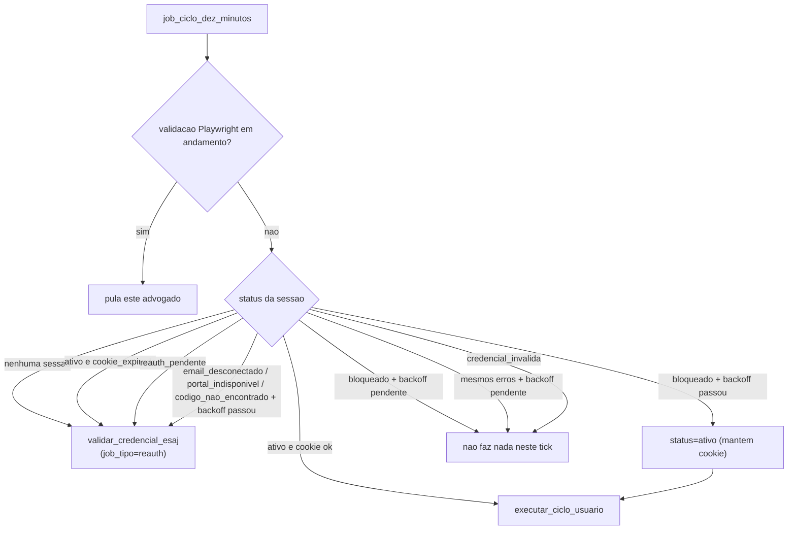

# Módulo: Scheduler e Ciclo Automático

> Última atualização: 2026-09-06
> Camada: Backend

---

## O que este módulo faz

Integra o APScheduler ao processo FastAPI com três jobs — renovação noturna do cookie do e-SAJ, o ciclo de pipes a cada 10 minutos, e o complemento diário via DataJud (Etapa 9) — e decide, por advogado, se roda a coleta ou dispara uma reautenticação, com base no `status` de `tribunal_sessions` e no backoff (`proximo_retry`) de falhas anteriores. Em `APP_ENV=development` os jobs **não** sobem (override `SCHEDULER_ENABLED=true`).

---

## Arquivos principais

| Arquivo | Responsabilidade |
|---|---|
| `backend/app/core/scheduler.py` | `AsyncIOScheduler`, registro dos dois jobs (`CronTrigger`/`IntervalTrigger`), timezone explícito |
| `backend/app/core/backoff.py` | `calcular_proximo_retry` — backoff compartilhado (5→15→60min) entre login e rate limit dos pipes |
| `backend/app/services/scheduler_jobs.py` | `job_renovacao_diaria`, `job_ciclo_dez_minutos` e a decisão por advogado (`_processar_advogado`) |
| `backend/app/services/credential_validation.py` | `validar_credencial_esaj(user_id, job_tipo=...)` e `validacao_em_andamento(user_id)` — reaproveitado pelo cron, pelo ciclo de 10 min e pelo fluxo manual (`/credentials/esaj`, `/revalidar`) |
| `backend/app/services/coleta_esaj.py` | `executar_ciclo_usuario` — pipes quando a sessão está `ativo` com cookie válido; `cookie_expirado()` e `EsajRateLimitError` (`bloqueado`) |
| `backend/app/services/esaj_http.py` | `EsajRateLimitError` (HTTP 429) — distinto de `EsajSessaoInvalidaError`/`EsajPortalIndisponivelError` |
| `backend/app/services/datajud_jobs.py` | `job_datajud_diario` — job de sistema (não por advogado) que complementa um lote de processos via DataJud, isolado do ciclo de 10 min (Etapa 9, ver `/docs/modulos/datajud.md`) |
| `backend/app/main.py` | `lifespan` — inicia/para o scheduler junto do processo FastAPI |
| `backend/app/core/config.py` | `scheduler_enabled` — default off em `development`, on fora; override via `SCHEDULER_ENABLED` |

---

## Jobs e schedulers

| Job | Frequência | Descrição |
|---|---|---|
| `job_renovacao_diaria` | Cron, 1h da manhã (`America/Sao_Paulo`) | Renova o cookie de **todos** os advogados com credencial ativa (`TribunalCredential.is_active=True`), independente do status atual da sessão — chama `validar_credencial_esaj(user_id, job_tipo="reauth")` |
| `job_ciclo_dez_minutos` | Interval, 10 minutos | Para cada advogado com credencial ativa: se Playwright já está rodando, skip; senão decide por sessão — pipes (`ativo` com cookie válido), reauth (`ativo` com cookie expirado, `reauth_pendente`, ou erros com backoff expirado), retoma pipes (`bloqueado` + backoff expirado), ou não faz nada (backoff pendente) |
| `job_datajud_diario` | Cron, 3h da manhã (`America/Sao_Paulo`) | Job de **sistema** (não por advogado): seleciona um lote round-robin de processos de todos os advogados (nunca consultado primeiro, depois o mais atrasado) e complementa via DataJud — ver `/docs/modulos/datajud.md` (Etapa 9 / ADR-015) |

Os três jobs: `id` fixo, `replace_existing=True`, `max_instances=1`, `coalesce=True` — uma execução atrasada nunca roda em paralelo com a próxima, só recupera o atraso.

### Por que timezone explícito no cron

O Railway roda o container em UTC. Sem `timezone=ZoneInfo("America/Sao_Paulo")` no `CronTrigger`, "1h da manhã" dispararia à 1h UTC (22h em Brasília, ainda dentro do horário comercial). O timezone é passado no trigger, não configurado no SO — ver ADR-011.

### Decisão por advogado (`job_ciclo_dez_minutos`)



`credencial_invalida` nunca deveria chegar nessa decisão — `TribunalCredential.is_active=False` já tira o advogado do filtro da query (mesma regra desde a Etapa 6: só o advogado corrigindo a senha reativa a credencial).

---

## Tratamento de erros por tipo

| Erro | Sessão vira | Cookie | Quem retenta |
|---|---|---|---|
| Cookie expirado/inválido (`EsajSessaoInvalidaError`, redirect para login) | `reauth_pendente` | Anulado | `job_ciclo_dez_minutos` no próximo tick (`validar_credencial_esaj`; duplicata barrada em memória) ou o próprio advogado clicando "Revalidar" |
| Rate limit (`EsajRateLimitError`, HTTP 429) | `bloqueado` | **Mantido** | `job_ciclo_dez_minutos`, direto nos pipes, sem reauth, quando `proximo_retry` passar |
| Portal fora do ar (`EsajPortalIndisponivelError`, 5xx/timeout/parse) nos **pipes** | Sessão inalterada | Mantido | Próximo ciclo de 10 min tenta de novo (não é erro fatal do advogado) |
| Portal fora do ar durante o **login** (Playwright) | `portal_indisponivel` | Anulado | `job_ciclo_dez_minutos`, via reauth, quando `proximo_retry` passar |
| Credencial inválida (senha trocada) | `credencial_invalida` + `TribunalCredential.is_active=False` | Anulado | Nenhum — só o advogado recadastrando a senha |
| E-mail OAuth2 desconectado | `email_desconectado` | Anulado | `job_ciclo_dez_minutos`, via reauth, quando `proximo_retry` passar (mas sem e-mail conectado a tentativa falha de novo até o advogado reconectar) |

Backoff (`app/core/backoff.py`): 1ª falha 5min, 2ª 15min, 3ª+ 60min — mesma escala para falha de login e rate limit dos pipes, porque o recurso limitado do outro lado (e-SAJ) é o mesmo. Zerado automaticamente na próxima execução bem-sucedida.

---

## Padrões seguidos neste módulo

- **Isolamento por advogado:** todo loop sobre múltiplos `user_id` (`job_renovacao_diaria`, `job_ciclo_dez_minutos`) usa `try/except` por iteração — falha de um nunca impede os demais (`security.mdc` §8)
- **Cookie só em memória:** `job_ciclo_dez_minutos`/`executar_ciclo_usuario` nunca guardam cookie decriptado fora do escopo da chamada
- **Contexto Playwright isolado:** `validar_credencial_esaj` (reaproveitado pelo cron) já seguia essa regra desde a Etapa 6 — nada mudou aqui
- **Nunca reautenticar sem necessidade:** rate limit (429) mantém o cookie e não passa pelo Playwright — só os erros que realmente invalidam a sessão disparam login completo
- **Recuperação de estado travado:** `reauth_pendente` dispara `validar_credencial_esaj` no próximo tick. Duplicata no mesmo processo é barrada por `_VALIDACOES_EM_ANDAMENTO`; restart retenta na hora (fecha o gap da ADR-008)
- **Cookie expirado em `ativo`:** `cookie_expirado()` dispara reauth e pula pipes (scheduler e `executar_ciclo_usuario`)
- **Choque 1h:** `validacao_em_andamento(user_id)` faz o ciclo de 10 min pular o advogado enquanto o Playwright da renovação noturna (ou Revalidar) está no ar
- **`job_tipo` no `JobLog`:** cron noturno grava `tipo=reauth`; disparo do próprio advogado (`/credentials/esaj`, `/revalidar`) continua `tipo=login` — mesma função, rótulo diferente para auditoria
- **Off em development:** `scheduler_enabled` deriva de `APP_ENV` (False em development, True fora); `SCHEDULER_ENABLED` explícito sempre ganha

---

## Modelo de dados relacionado

Nenhuma tabela nova — reaproveita `tribunal_sessions` e `job_logs`. Campos que a decisão por advogado lê:

```python
class TribunalSession(UUIDPrimaryKeyMixin, TimestampMixin, Base):
    cookie_encrypted: Mapped[bytes | None]
    expires_at: Mapped[datetime | None]     # cookie_expirado() se ativo e prazo passou
    status: Mapped[str]                     # SESSION_STATUSES
    tentativas_falha: Mapped[int]
    proximo_retry: Mapped[datetime | None]  # backoff 5→15→60min
```

`cookie_expirado()` é `True` quando `status == ativo` e o blob sumiu ou `expires_at` já passou. Ver `backend/app/models/tribunal.py` e `backend/app/models/job_log.py`.

---

## Dependências de outros módulos

| Módulo | Por quê depende |
|---|---|
| Credenciais / Login e-SAJ | `validar_credencial_esaj` é o mesmo motor de login do cadastro/revalidação manual |
| Contrato das APIs e-SAJ (pipes) | `executar_ciclo_usuario` e `EsajRateLimitError` vivem em `coleta_esaj.py`/`esaj_http.py` |
| Migrations | `tribunal_sessions.proximo_retry`/`tentativas_falha` já existiam desde etapas anteriores |

---

## O que NÃO fazer aqui

- ❌ Não ligar o scheduler em `APP_ENV=development` sem `SCHEDULER_ENABLED=true` — o default é off de propósito (uvicorn --reload dispararia Playwright/httpx contra o e-SAJ)
- ❌ Não disparar pipes enquanto `validacao_em_andamento(user_id)` — o Playwright da renovação/Revalidar pode estar anulando o cookie agora
- ❌ Não esperar 5 min em `reauth_pendente` para retentar — o stale (`REAUTH_PENDENTE_STALE_MINUTOS`) foi removido; o set em memória cobre duplicata no processo, restart retenta na hora
- ❌ Não chamar `scheduler.start()`/`shutdown()` fora do `lifespan` do FastAPI — o scheduler é um singleton do processo, iniciar duas vezes sem `replace_existing` duplica jobs
- ❌ Não disparar reautenticação completa (Playwright) para rate limit (429) — o cookie continua bom, só espera o backoff
- ❌ Não ignorar `proximo_retry` ao decidir se retenta — sem isso o scheduler martela o e-SAJ a cada 10 min durante um bloqueio
- ❌ Não resetar `bloqueado` → `ativo` sem reconsultar o banco — outra rotina (ex.: advogado clicando "Revalidar") pode ter mudado o status nesse meio tempo
- ❌ Não tornar os horários configuráveis por variável de ambiente nesta etapa — decisão consciente, mesma linha de `TIMEOUT_VALIDACAO_SEGUNDOS`
- ❌ Não deixar o `AsyncIOScheduler` sem timezone explícito — o host roda em UTC

---

## Histórico de mudanças relevantes

| Data | O que mudou |
|---|---|
| 2026-08-21 | Implementação inicial: dois jobs (`job_renovacao_diaria`, `job_ciclo_dez_minutos`), decisão por advogado, `EsajRateLimitError` com backoff próprio, recuperação de `reauth_pendente` travado (ADR-008/ADR-011) |
| 2026-08-21 | Hardening pós-review: scheduler off em development; `ativo`+cookie expirado → reauth; `reauth_pendente` retenta no tick (sem stale de 5 min); skip pipes se validação Playwright em andamento |
| 2026-09-06 | Etapa 9: terceiro job (`job_datajud_diario`, cron 3h) — job de sistema, fora do ciclo por advogado, detalhado em `/docs/modulos/datajud.md` |
